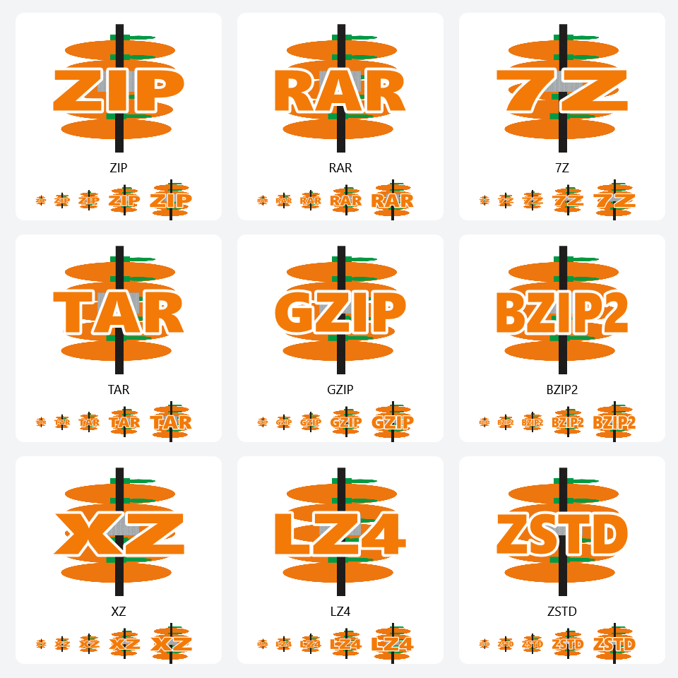

# 默认打开方式设置（2026-10-01）

> **自动关联更新：** 第一个按钮按 Windows 实际格式选择经典 SFTA 或 [UserChoiceLatest 实现](USERCHOICE_LATEST.md)，在后台尝试并核验；成功时直接处理下一格式，失败时显示阶段码及重试/跳过/停止，不操作系统设置界面。经典路径见 [SFTA_AUTOMATIC_DEFAULTS.md](SFTA_AUTOMATIC_DEFAULTS.md)。本机 ZIP/RAR 使用 UserChoiceLatest，尚未验证真实已有默认程序的切换。

## 菜单与窗口

原菜单栏“右键菜单”改为“为系统做设置”。XAML 对象及代码字段改为 `systemSettingsMenuItem`，本地化键改为 `SystemSettingsMenu`，原来的创建/删除右键菜单入口继续保留其明确的对象名和键名。新增 `defaultOpenWithMenuItem` 和 `DefaultOpenWithMenu_Click`，打开 `DefaultOpenWithWindow`。

窗口沿用 `Theme.xaml`、动态主题画刷、系统字号及鼠标效果。九个格式复选框初始均不勾选：ZIP、RAR、7z、TAR、GZip、BZip2、XZ、LZ4、Zstandard。Zstandard 包含 `.zst`、`.zstd` 两个扩展名，Windows 对它们分别保存默认关联，因此勾选这个格式会逐一处理这两个扩展名。ISO、WIM、Office ZIP 容器及通用分卷 `.001` 不进入此功能。

窗口底部初始提供两个按钮：

- **这些格式用本软件打开**：将本软件注册为当前用户的可选打开程序，按检测到的哈希格式自动尝试设置，并核验实际生效的 ProgID。已正确关联或自动设置成功的项直接继续；失败项提供重试/跳过/停止，不要求用户逐一手动设置。
- **为这些格式设置打开方式**：同样注册本软件供用户选择，但打开通用默认应用设置页，用户可为当前扩展名选择任何软件。完成后点“下一格式”，日志记录实际打开程序标识，此流程统计“已查看设置”，不宣称本软件成为默认应用或宣称用户修改了关联。

格式选择区新增 **全选** / **全不选**，只改变九个格式复选框，不修改关联或立即启动系统设置。九个格式仍初始不勾选；流程开始后快捷按钮和复选框同时禁用，停止或完成后恢复，避免界面选择与已排队的扩展名不一致。`DefaultAppsSelectAll` / `DefaultAppsSelectNone` 覆盖六套资源，选择异常使用 `DAPWN0004`。

窗口采用 Grid 的 `Auto` / 星号比例行、可换行按钮和复选框、可滚动说明及日志区域。删除格式区固定的 `MaxHeight=180`；当前操作说明的最大高度由选择区实际可用高度决定。按钮内容按可用宽度换行，控件没有固定像素宽高；共用复选框的标记尺寸绑定实际 FontSize。相关窗口布局和禁止控制台闪窗的实现详见 [`WINDOW_LAYOUT_AND_PROCESS_STARTUP.md`](WINDOW_LAYOUT_AND_PROCESS_STARTUP.md)。

第一个按钮的序列连续处理所选扩展名；只有错误时提供重试/跳过/停止。第二个按钮的序列显示“下一格式”和“停止流程”，等待用户完成系统设置。不同时打开多个设置窗口，也不使用定时器猜测用户何时完成。当前扩展名和总进度始终可见。未选择任何格式时报告 `DAPWN0002`。取消系统设置、选择其他软件或保留原默认值均是第二按钮的正常结果。关闭窗口时，等待用户选择的序列可直接结束；后台注册正在写入时暂缓关闭，待写入或回滚完成，避免异步操作继续访问已关闭窗口。

## Windows 默认应用限制与兼容

Windows 8 起，不允许应用通过官方 API 自行覆盖用户默认选择。Windows 10/11 的 `SHOpenWithDialog` 不再具备设置默认应用的功能，注册相关标志会被忽略。`IApplicationAssociationRegistration.SetAppAsDefault/SetAppAsDefaultAll` 也不适用于这些系统。第一个按钮尝试非官方哈希机制并核验；管理员权限不能保证绕过系统保护，也不能把仅写入注册表误报为设置完成。参见[微软默认应用平台文档](https://learn.microsoft.com/en-us/windows/apps/develop/windows-integration/default-apps-platform)。

| 系统 | 第一按钮自动路径 | 第二按钮选择任意软件 |
| --- | --- | --- |
| Windows 10 | 经典 SFTA，核验实际生效的 ProgID | `ms-settings:defaultapps` 通用页 |
| Windows 11 初版及后续版本 | 检查当前用户 HashVersion 与键格式，选择经典 SFTA 或 UserChoiceLatest；逐项核验 | `ms-settings:defaultapps` 通用页 |

`OpenWindowsSettings` 仍保存 Win11 专属应用页 URI 的兼容计算：21H2/22H2 读取 `HKLM\SOFTWARE\Microsoft\Windows NT\CurrentVersion` 的 `UBR` 确定累计更新修订号，读取失败记录 `DEFAS0004`；启动失败记录 `DEFAS0005` 并回退通用页。当前第一按钮不调用它，第二按钮只请求通用页。调用 `Process.Start` 只表示把请求交给 Windows；系统可能复用已存在的设置进程，因此空进程返回值不能用来判断默认选择成败。

当前没有使用未在官方文档中提供的逐扩展名 Settings URI 参数；通用页内的扩展名定位由用户完成，程序显示对应 Win10/Win11 操作说明。机器策略可能限制设置，程序不会将策略阻止或启动成功误报为设置完成。

## 当前用户注册与权限

`DefaultAppAssociationService.BuildRegistrationPlan` 构建明确的注册写入计划，`RegisterHandler` 逐项写入并回读：

| 当前用户键路径 | 用途 |
| --- | --- |
| `HKCU\Software\Classes\TangerineZip.Archive.<extension>` | 每个扩展名的独立 ProgID、图标、`shell\open\command` |
| `HKCU\Software\Classes\.<extension>\OpenWithProgids` | 本软件作为可选打开程序 |
| `HKCU\Software\TangerineZip\DefaultApps\Capabilities` | 应用名称、描述、图标及 `FileAssociations` |
| `HKCU\Software\RegisteredApplications` | `TANGERINE ZIP` → 上述 Capabilities 路径 |

命令行为 `"<实际 EXE 的完整路径>" "%1"`。`Environment.ProcessPath` 兼容改名的发布 EXE 和单文件程序；拒绝以 `dotnet.exe` 运行 DLL 的场景。移动 EXE 后应再次注册所需格式，以更新命令路径。设置窗口无参数构造只创建 UI，不写注册表。

**本功能无需管理员权限。** 所有写操作限定在 HKCU，窗口明确说明作用于当前账户及原因。HKLM 仅用于读取系统修订号。程序不修改扩展名的默认值，不修改或删除 `Explorer\FileExts\...\UserChoice`，不生成其 Hash，不调用过时的默认设置 API，不通过 UAC 尝试绕过用户确认。组织策略或当前用户注册权限不足时报告错误，提权不会解除 Windows 默认选择保护。原右键菜单安装向机器证书库写入证书时的 UAC 提示及流程仍由其自身窗口负责。

注册失败时按逆序恢复已经触及的值，保留原值的数据和注册表类型；原本不存在的值仅删除该值。不会递归删除祖先键或其他程序的登记。回滚再次失败使用 `DEFAS0007`，保留原注册异常和回滚异常于 `AggregateException` 中，并提示候选程序登记可能不完整。注册成功后使用 `SHChangeNotify(SHCNE_ASSOCCHANGED)` 通知 Explorer 刷新。

同一登录会话的本软件实例使用带用户 SID 的命名互斥锁串行化注册，最多等待 5 秒，避免两个实例交错写入和回滚共享的 Capabilities 值。超时或无法取得锁时报告 `DEFAS0009`。若前一进程异常退出留下 abandoned mutex，当前线程取得所有权后重新写入完整注册计划；候选登记的中断不涉及受保护的默认选择。

`AssocQueryStringW(ASSOCSTR_PROGID)` 查询实际 Shell 关联，避免把刚写入的 Capabilities 当成默认选择。没有关联属于正常结果；其他 HRESULT、无效缓冲长度及查询期间的缓冲竞争均有明确处理。用户尚未选择本软件时提供正常引导，不请求 UAC。

## 格式文件图标

先完成图标设计并检查多尺寸预览，再接入文件关联。图标沿用 `Resources/TZIP.png` 原图，仅在构图时裁去周围空白；格式文字使用粗体轮廓，橙色主体 `#F37A07`、白色描边。实际字形边界占 512 设计画布的 474 宽，纵向中心为 256；文字高度为 146。九种标识为 ZIP、RAR、7Z、TAR、GZIP、BZIP2、XZ、LZ4、ZSTD；`.zst`、`.zstd` 共用 ZSTD 图标。ISO/WIM 仍不参与此功能。



`Resources/FileTypeIcons` 保存可编辑的 WPF DrawingGroup XAML 母版和 ICO。每个 ICO 内含 16、24、32、48、64、128、256 像素、32 位 PNG 帧，各尺寸独立渲染字形，适用于 Win10、初代 Win11 及后续 Win11 的图标读取。16 像素下长格式名受像素数量限制，24 像素及以上更容易辨认。普通 `tzip.ico` 不含格式文字，作为 EXE 的应用图标；文件关联采用各自带格式名的图标。

生成工具位于 `tools/ArchiveIconDesigner`，只使用 .NET/WPF 和原 logo，不需要额外图像包。重新生成：

```powershell
dotnet run --project tools/ArchiveIconDesigner -- "C:\Users\Sean\source\repos\TANGERINE-ZIP"
```

工具将字体转换为显式路径，母版不依赖终端用户安装相同字体；ICO 不包含字体引用。母版中的 logo 引用为 `../TZIP.png`。重新生成需要开发机的 Segoe UI Black 字体；开发机字体版本差异可能影响字形，应复查预览。

`ArchiveFileIconService` 从主程序集内嵌资源读取 ICO，支持依赖框架与自包含两种单文件发布。图标落地到 `%LOCALAPPDATA%\TangerineZip\DefaultApps\Icons\<format>-<完整 SHA256>.ico`。内容哈希让升级后的不同图案获得新缓存路径；保留旧哈希文件，防止其他安装版本或已有关联仍引用旧文件。图标不放在临时解包目录、用户选择的 TEMP_D 或发布 EXE 旁边，软件关闭后 Explorer 仍能读取。

注册互斥锁范围内先生成并核验图标，然后构建注册计划。文件通过同目录独有临时文件、磁盘刷新和原子改名发布；已存在且内容相同的文件直接复用，损坏文件重新发布。成功回读后才将完整路径加引号写入 `HKCU\Software\Classes\TangerineZip.Archive.<extension>\DefaultIcon`，图标索引为 0。此值属于本软件自己的 ProgID；不会写入 `.<extension>\DefaultIcon` 或其他软件的 ProgID。Capabilities 的 ApplicationIcon 仍指向带普通 logo 的 EXE。

注册成功后调用 `SHChangeNotify(SHCNE_ASSOCCHANGED, SHCNF_IDLIST, ...)` 通知 Shell 更新关联和图标缓存。用户确实选择本软件为默认应用后，对应文件显示其格式图标；选择其他软件时继续采用其他软件的图标。已默认由本软件打开的格式，在重新执行此流程时也先刷新注册、修复缓存，再核验默认关联。Windows 的界面刷新可能稍有延迟，不重启 Explorer、不删除系统图标缓存。整个流程仅写当前用户的数据和注册表，无需 UAC。

图标失败发生在注册写入之前：`DEFAS0010` 提供本地化读取/保存/核验错误，可重试、跳过或停止；若清理专属临时文件也失败，`DEFAS0011` 的 AggregateException 同时保留原错误与清理错误。

## 本地化、英文注释与 StageCode

新窗口的说明、权限提示、按钮、操作指引、进度、摘要及全部错误提示覆盖中性英文、`en-US`、`zh-CN`、`zh-TW`、`zh-HK`、`zh-MO` 六套资源。技术格式名、扩展名和诊断 ProgID 保持不随语言变化。旧大菜单 `ContextMenu` 资源键已删除并替换为 `SystemSettingsMenu`。

代码中的英文注释说明 Windows 默认应用保护、官方 API 选择、初代 Win11 更新门槛、注册与默认选择的区别、HKCU 权限范围、注册回滚、路径引用、异步关闭行为、没有系统完成回调时的逐项流程及实际默认关联核验。

| 阶段码 | 分支与处理 |
| --- | --- |
| `MAINW0026` | 创建或显示窗口失败，由主窗口显示错误 |
| `DAPWN0001` | 按钮或结果核验出现未预料错误，当前扩展名保持等待 |
| `DAPWN0002` | 未选择格式，不进行注册或打开系统设置 |
| `DAPWN0003` | 当前扩展名准备失败，提供重试/跳过/停止 |
| `DAPWN0004` | 批量修改复选框失败；设置流程进行中不接受批量修改 |
| `DEFAS0001` | 不支持的系统或扩展名，包括 ISO/WIM |
| `DEFAS0002` | EXE 缺失或由 dotnet.exe 托管 |
| `DEFAS0003` | 注册写入/回读失败，已写入值回滚 |
| `DEFAS0004` | 无法读取更新修订号，日志记录并回退通用设置 |
| `DEFAS0005` | 官方设置启动失败，按页面类型回退或提示错误 |
| `DEFAS0006` | 实际默认 ProgID 查询失败，不计为设置成功 |
| `DEFAS0007` | 注册失败且回滚也失败，显示候选注册可能不完整 |
| `DEFAS0008` | 注册成功但 Explorer 通知失败，可重试刷新 |
| `DEFAS0009` | 注册互斥锁不可用或等待超时，提示稍后重试 |
| `DEFAS0010` | 格式图标读取/保存/核验失败，尚未开始写入候选注册 |
| `DEFAS0011` | 图标保存失败且临时文件清理也失败，保留两项异常 |

全部阶段码登记在 `Resources/StageList.txt`。跨服务边界保留已有 `StageException.StageCode`，仅为未预期错误设置窗口边界兜底码。取消或未选择本软件是普通流程结果，不冒充异常或成功。

## 官方资料

- [Microsoft：Launch the Default Apps settings page](https://learn.microsoft.com/en-us/windows/apps/develop/launch/launch-default-apps-settings)
- [Microsoft：SHOpenWithDialog 在 Windows 10 起的限制](https://learn.microsoft.com/en-us/windows/win32/api/shlobj_core/nf-shlobj_core-shopenwithdialog)
- [Microsoft：Default Programs 注册规范](https://learn.microsoft.com/en-us/windows/win32/shell/default-programs)
- [Microsoft：IApplicationAssociationRegistration 的系统支持范围](https://learn.microsoft.com/en-us/windows/win32/api/shobjidl_core/nn-shobjidl_core-iapplicationassociationregistration)
- [Microsoft：Assign a Custom Icon to a File Type](https://learn.microsoft.com/en-us/windows/win32/shell/how-to-assign-a-custom-icon-to-a-file-type)
- [Microsoft：SHChangeNotify 关联及图标缓存通知](https://learn.microsoft.com/en-us/windows/win32/api/shlobj_core/nf-shlobj_core-shchangenotify)

## 验证范围

- `dotnet build TANGERINE-ZIP/TANGERINE-ZIP.csproj -c Release --no-restore`：成功，0 警告、0 错误。
- 临时验证程序实际调用编译后的服务，验证九种格式/十个扩展名、ISO/WIM/`.001` 及非白名单路径拦截、带空格及改名 EXE 的命令引用；注册计划不含扩展名默认值或受保护的 `UserChoice` 写入。
- 验证 Win10 通用页面、Win11 初版通用页面、`22000.1816/1817` 和 `22621.1554/1555` 门槛，以及 `22631/26100` 专属页面路由；任意软件流程在各分支始终使用通用页面。
- 六套 XML 资源解析、键完整性和格式化占位符检查通过；调用本机 `AssocQueryStringW` 读取 `.zip`、`.rar`、`.7z`、`.zst`、`.zstd` 生效关联通过。
- 图标扩展验证程序共通过 1160 项检查：九种格式/十个扩展名的内嵌资源、每个 ICO 的七个尺寸及帧范围、PNG 实际解码、原生 `SHDefExtractIconW` 大小图标读取、SHA256 命名、带空格缓存目录、无修改复用、损坏后重建、Zstandard 双后缀共享图标、禁止 ISO 以及缓存路径不可用时 `DEFAS0010` 异常。缓存测试在工作区内 GUID 专属目录完成并清理，没有更改用户真实默认应用。
- 在新建的 GUID 专属 `HKCU\Software\TangerineZip\Verification\DefaultApps_<GUID>` 子树内重定向注册计划，验证写入和回读；在完成前序写入后注入注册错误，确认 Binary/DWord 原值和数据类型恢复、无关值保留、新值清除、原扩展名默认值未被覆盖。测试后删除该专属子树；没有写入实际 Classes、RegisteredApplications 或真实默认应用选择。
- 用隔离 WPF 预览程序打开真实 `DefaultOpenWithWindow`，查看简中布局、九个默认未勾选的格式及两个操作按钮；点击未选格式的第一按钮，确认出现带 `DAPWN0002` 的本地化主题提示。预览窗口已关闭。
- 图标接入后再次打开隔离的简中窗口，确认新增图标说明完整显示，复选框、日志区和按钮布局正常；已关闭窗口并移除预览启动标记。
- 布局及快捷按钮更新后的验证共通过 1368 项检查；在五种 UI 文化下验证全选/全不选、流程进行时不修改选择，使用 360×300、640×420、1200×720 的可用布局区域及 12/24 字号验证底部按钮无越界且保持自适应尺寸。这里的尺寸是测试输入，不是产品控件固定尺寸。两种单文件发布的 Windows GUI 子系统、原生 CLI/worker 重定向及 ZIP 创建/列出/解压往返也通过验证。
- 实际简中窗口点击全选后九项全部出现勾选标记，点击全不选后全部清除；按钮保持共用主题的颜色及内边距。预览窗口已关闭，启动标记已删除。
- 没有在测试中更改真实用户默认应用；也未在 Win10、初代 Win11 虚拟机或实机中完成全流程切换、组织策略阻止、互斥锁竞争、注册回滚失败及设置应用启动失败的人工回归。上述 Windows 版本兼容判断已按官方接口说明和分支验证覆盖，不计为这些系统的实机测试。
